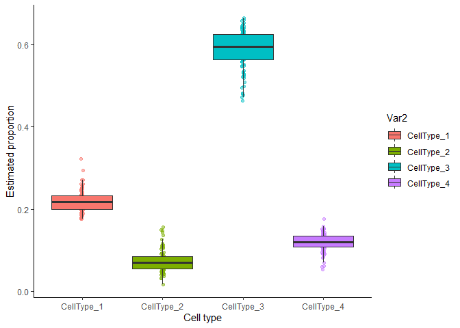
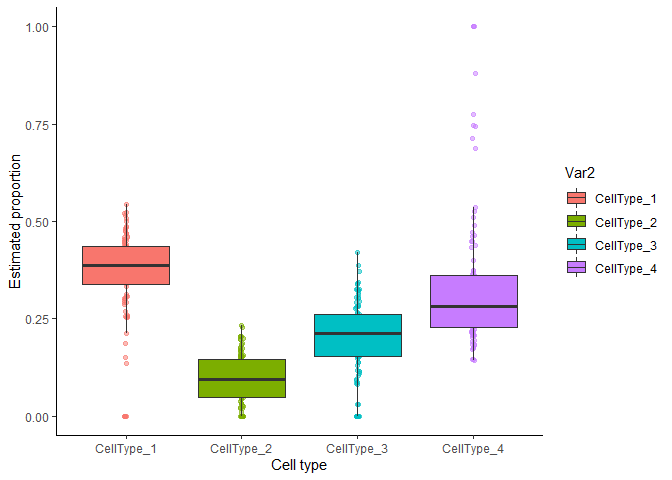

mcQTL: Multi-omic and Cell-type-specific Quantitative Trait Loci
================
Yue Pan
09 March, 2023

# Install

``` r
#devtools::install_github("YuePan027/mcQTL@dev") # from dev branch
library(mcQTL)
library(ggplot2)
```

# Quick start

## Cell-type proportion deconvolution

This step is used to obtain cell-type proportion.

A `SummarizedExperiment` object with bulk protein or gene expression
contained in `counts` slot, and a “signature matrix” which serves as a
reference of known cellular signatures contained as an element in
`metadata` slot is required as input file. Note that the proteins or
genes in signature matrix can be different from that in assay, but only
common proteins or genes will be used to do deconvolution.

In this current version, only `CIBERSORT` and `nnls` are supported as
the deconvolution methods.

``` r
se <- SummarizedExperiment(assays = list(counts = mcQTL::protein_data),
                           rowData = mcQTL::anno_protein)
metadata(se) <- list(sig_matrix = mcQTL::ref_data)
se <- deconv(se, "cibersort")
```

This step might take a few minutes if there are many proteins or genes
in the signature matrix. The cell-type proportion estimates for each
sample will be stored as an element (`prop`) in `metadata` slot.

``` r
head(se@metadata$prop)
#>          CellType_1 CellType_2 CellType_3 CellType_4
#> Sample_1  0.2325557 0.06702399  0.5997269 0.10069340
#> Sample_2  0.1756690 0.04542362  0.6332230 0.14568439
#> Sample_3  0.1910644 0.08487123  0.6093489 0.11471552
#> Sample_4  0.2513749 0.07693023  0.5695605 0.10213434
#> Sample_5  0.2137109 0.10576155  0.5486246 0.13190293
#> Sample_6  0.3227685 0.05524151  0.5693060 0.05268406

ggplot(data.frame(reshape2::melt(se@metadata$prop)), 
       aes(x = Var2, y = value, fill = Var2)) +
  geom_point(position = position_jitterdodge(jitter.width = 0.1,
                                           dodge.width = 0.7),
           aes(fill = Var2, color = Var2),
           pch = 21, alpha = 0.5) +
  geom_boxplot(lwd=0.7, outlier.shape = NA) +
  theme_classic() +
  xlab("Cell type") + ylab("Estimated proportion")
```

<!-- -->

Alternatively, if there are cell-type proportion estimates results
generated using other methods or obtained from other sources, just save
that as an element (`prop`) in `metadata` slot and this deconvolution
step can be skipped. Note that the samples in the cell-type proportion
estimates must match the samples from bulk protein/gene expression data.

## Feature filtering

The feature filtering can be applied at both proteins/genes and SNPs.
This step is optional but highly recommended to filter out some features
that are not very informative or do not make much sense biologically.
Note that this function is required to run even no filtering is expected
to be done (just set `filter_method = "null"`) to obtain a consistent
object format for downstream analysis.

To apply feature filtering, annotation files for protein/gene and SNPs
are required. The annotation file for proteins/genes should be stored in
`rowData()`, where each row corresponds to a protein/gene with it’s
symbol as row names. The first column should be a character vector
indicating which chromosome each protein or gene is on. In addition, it
should contain at least a “Start” column with numeric values indicating
the start position on that chromosome, a “End” column with numeric
values indicating the end position on that chromosome and a “Symbol”
column as a unique name for each protein or gene.

``` r
head(rowData(se))
#> DataFrame with 6 rows and 4 columns
#>                   Chr     Start       End      Symbol
#>           <character> <integer> <integer> <character>
#> Protein_1          15  67202823  67254631   Protein_1
#> Protein_2           6  44300549  44313323   Protein_2
#> Protein_3           7 122076491 122133726   Protein_3
#> Protein_4          16   8735739   8781427   Protein_4
#> Protein_5           9 104784317 104903679   Protein_5
#> Protein_6           9 137007931 137028140   Protein_6
```

The information from genetic variants should be stored in a P (the
number of SNP) by N (the number of samples, should match the sample in
`counts` slot) matrix contained as an element (`SNP_data`) in `metadata`
slot. Each matrix entry corresponds to the genotype group indicator (0
for 0/0, 1 for 0/1 and 2 for 1/1) for a sample at a genetic location.
The annotations of these SNP should be stored as an element (`anno_SNP`)
in `metadata` slot. It should include at least the following columns:
(1) “CHROM” (which chromosome the SNP is on); (2) “POS” (position of
that SNP) and (3) “ID” (a unique identifier for each SNP, usually a
combination of chromosome and its position).

The example SNP data provided here were restricted to chromosome 9 only.
In practice, the SNPs may from multiple or even all chromosomes.

``` r
se@metadata$SNP_data <- mcQTL::SNP_data
se@metadata$anno_SNP <- mcQTL::anno_SNP
head(se@metadata$anno_SNP)
#>        CHROM       POS          ID
#> 237392     9 104596634 9:104596634
#> 106390     9  28487163  9:28487163
#> 304108     9 126307371 9:126307371
#> 295846     9 122787821 9:122787821
#> 126055     9  33975396  9:33975396
#> 342900     9 140300675 9:140300675
```

For filtering at protein or gene level, only those symbols contained in
`target_protein` argument will be kept for csQTL analysis in the next
step. By default, all proteins or genes will be used.

For filtering at SNP level, there are three options: (1) only those
symbols contained in `target_SNP` argument will be kept and if not
provided, all SNPs will be used for further filtering; (2) filter out
the SNPs that have minor allele frequency below the threshold defined by
`filter_allele` argument (`filter_method = "allele"`) and (3) restrict
to cis-regulatory variants, i.e. the SNPs up to 1 Mb proximal to the
start of the gene (`filter_method = "distance"`).

The results after filtering will be stored as an element
(`choose_SNP_list`) in `metadata` slot. It is a list with the length of
the number of proteins for downstream analysis. Each element stores the
index of SNPs to be tested for corresponding protein. The proteins with
no SNPs correspond to it will be removed from the returned list.

To simplify the analysis, we only kept 10 targeted proteins from
chromosome 9 as an example.

``` r
target_protein <- rowData(se)[rowData(se)$Chr == 9,][1:10, "Symbol"]
se <- feature_filter(se, target_protein = target_protein, 
                     filter_method = c("allele", "distance"), 
                     filter_allele = 0.25,
                     filter_geno = 0.05,
                     ref_position = "TSS")           
#> Filter SNP based on distance for protein Protein_261
#> Filter SNP based on distance for protein Protein_241
#> Filter SNP based on distance for protein Protein_238
#> Filter SNP based on distance for protein Protein_131
#> Filter SNP based on distance for protein Protein_93
#> Filter SNP based on distance for protein Protein_88
#> Filter SNP based on distance for protein Protein_79
#> Filter SNP based on distance for protein Protein_6
#> Filter SNP based on distance for protein Protein_5
#> Filter SNP based on distance for protein Protein_283
```

In this example, only 20 SNPs are kept for the first target protein and
only 20 SNPs are kept for the second target protein.

``` r
unlist(lapply(se@metadata$choose_SNP_list, length))
#>   Protein_5   Protein_6  Protein_79  Protein_88  Protein_93 Protein_238 
#>          20          20           6           9           9           9 
#> Protein_241 Protein_261 Protein_283 
#>          23          12          15
```

## csQTL analysis

In this step, the `TOAST` method is implemented for cell-type-specific
differential expression analysis based on samples’ genotype.

The result will be stored as an element (`TOAST_output`) in `metadata`
slot. It is a list with the same length as tested proteins or genes
where each element consists of a table including protein or gene symbol,
SNP ID and p-values from each cell type. A significant p-value indicates
that the protein or gene expression is different among the sample from
different genotype groups.

``` r
system.time(se <- csQTL(se))
#> csQTL test for protein Protein_5 
#> csQTL test for protein Protein_6 
#> csQTL test for protein Protein_79 
#> csQTL test for protein Protein_88 
#> csQTL test for protein Protein_93 
#> csQTL test for protein Protein_238 
#> csQTL test for protein Protein_241 
#> csQTL test for protein Protein_261 
#> csQTL test for protein Protein_283
#>    user  system elapsed 
#>    3.36    1.44  472.09
```

We can check the results from csQTL analysis for the first target
protein by calling:

``` r
head(se@metadata$TOAST_output[[1]])
#>     protein         SNP CellType_1 CellType_2 CellType_3 CellType_4
#> 1 Protein_5 9:104702846  0.6687429  0.6076771  0.7661268 0.85811387
#> 2 Protein_5 9:104294530  0.9907045  0.8567053  0.8213907 0.47889613
#> 3 Protein_5 9:104868031  0.2276643  0.6469674  0.5206621 0.04218665
#> 4 Protein_5 9:105077464  0.7764349  0.9948742  0.8729841 0.27895985
#> 5 Protein_5 9:105655745  0.5509189  0.8004329  0.5812060 0.01227444
#> 6 Protein_5 9:105510462  0.3154370  0.2156796  0.3124176 0.01278241
```

## Cross-source cell-type proportion deconvolution (optional)

Besides cell-type proportion deconvolution using single source as shown
above, we can also consider cross-source cell-type proportion
deconvolution if we have matched samples from a different source. In the
example below, we show how to estimate cell-type proportion from protein
data by using an initial proportion estimated from gene expression. To
explain the idea, we use randomly selected proteins as marker proteins.
But in practice, more meaningful proteins should be included.

``` r
prop_gene <- mcQTL::prop_gene
set.seed(1234)
in_example <- sample(1:nrow(mcQTL::protein_data), size=500, replace =F)
example_mrk <- rownames(mcQTL::protein_data)[in_example]
se <- cross_prop(se, ini_prop = prop_gene, mrk_prot = example_mrk)
#> INFO [2023-03-09 14:33:47] Starting tca...
#> INFO [2023-03-09 14:33:47] Validating input...
#> INFO [2023-03-09 14:33:47] Starting re-estimation of W...
#> INFO [2023-03-09 14:33:47] Performing feature selection using refactor...
#> INFO [2023-03-09 14:33:47] Starting refactor...
#> INFO [2023-03-09 14:33:47] Running PCA on X using rand_svd == TRUE...
#> INFO [2023-03-09 14:33:47] Computing a low rank approximation of X...
#> INFO [2023-03-09 14:33:47] Calculating the distance of each feature from its low rank approximation...
#> INFO [2023-03-09 14:33:47] Computing the ReFACTor components based on the top 500 features with lowest distances...
#> INFO [2023-03-09 14:33:47] Finished refactor.
#> INFO [2023-03-09 14:33:47] Fitting the TCA model using the selected features for re-estimating W...
#> INFO [2023-03-09 14:33:47] Iteration 1 out of 10 external iterations (fitting all parameters including W)...
#> INFO [2023-03-09 14:33:47] Fitting means and variances...
#> INFO [2023-03-09 14:33:47] Iteration 1 out of 10 internal iterations...
#> INFO [2023-03-09 14:33:47] Iteration 2 out of 10 internal iterations...
#> INFO [2023-03-09 14:33:47] Iteration 3 out of 10 internal iterations...
#> INFO [2023-03-09 14:33:47] Internal loop converged.
#> INFO [2023-03-09 14:33:47] Fitting W...
#> INFO [2023-03-09 14:33:48] Iteration 2 out of 10 external iterations (fitting all parameters including W)...
#> INFO [2023-03-09 14:33:48] Fitting means and variances...
#> INFO [2023-03-09 14:33:48] Iteration 1 out of 10 internal iterations...
#> INFO [2023-03-09 14:33:49] Iteration 2 out of 10 internal iterations...
#> INFO [2023-03-09 14:33:49] Internal loop converged.
#> INFO [2023-03-09 14:33:49] Fitting W...
#> INFO [2023-03-09 14:33:50] Iteration 3 out of 10 external iterations (fitting all parameters including W)...
#> INFO [2023-03-09 14:33:50] Fitting means and variances...
#> INFO [2023-03-09 14:33:50] Iteration 1 out of 10 internal iterations...
#> INFO [2023-03-09 14:33:50] Iteration 2 out of 10 internal iterations...
#> INFO [2023-03-09 14:33:50] Internal loop converged.
#> INFO [2023-03-09 14:33:50] Fitting W...
#> INFO [2023-03-09 14:33:51] Iteration 4 out of 10 external iterations (fitting all parameters including W)...
#> INFO [2023-03-09 14:33:51] Fitting means and variances...
#> INFO [2023-03-09 14:33:51] Iteration 1 out of 10 internal iterations...
#> INFO [2023-03-09 14:33:52] Iteration 2 out of 10 internal iterations...
#> INFO [2023-03-09 14:33:52] Internal loop converged.
#> INFO [2023-03-09 14:33:52] Fitting W...
#> INFO [2023-03-09 14:33:53] External loop converged.
#> INFO [2023-03-09 14:33:53] Calculate p-values for deltas and gammas.
#> INFO [2023-03-09 14:33:53] Fitting the TCA model given the updated W...
#> INFO [2023-03-09 14:33:53] Fitting means and variances...
#> INFO [2023-03-09 14:33:53] Iteration 1 out of 10 internal iterations...
#> INFO [2023-03-09 14:33:54] Iteration 2 out of 10 internal iterations...
#> INFO [2023-03-09 14:33:54] Internal loop converged.
#> INFO [2023-03-09 14:33:54] Calculate p-values for deltas and gammas.
#> INFO [2023-03-09 14:33:54] Finished tca.

ggplot(data.frame(reshape2::melt(se@metadata$cross_prop)), 
       aes(x = Var2, y = value, fill = Var2)) +
  geom_point(position = position_jitterdodge(jitter.width = 0.1,
                                           dodge.width = 0.7),
           aes(fill = Var2, color = Var2),
           pch = 21, alpha = 0.5) +
  geom_boxplot(lwd=0.7, outlier.shape = NA) +
  theme_classic() +
  xlab("Cell type") + ylab("Estimated proportion")
```

<!-- -->

## TCA deconvolution (optional)

The cell-type-specific gene expression per bulk sample can also be
estimated using `TCA` deconvolution method given cellular composition
(stored in `prop` in `metadata` slot). The output will be stored as an
element (`TCA_deconv`) in `metadata` slot. It is a list with the length
of the number of cell types (same as cell types in `prop` in `metadata`
slot). Each element stores a deconvoluted protein expression per bulk
sample. Below is an example to check the deconvoluted cellular
expression for the first cell type (restricted to first 5 proteins and
first 5 samples):

``` r
se <- TCA_deconv(se)
#> INFO [2023-03-09 14:33:58] Validating input...
#> INFO [2023-03-09 14:33:58] Starting tensor for estimating Z...
#> INFO [2023-03-09 14:33:59] Estimate tensor...
#> INFO [2023-03-09 14:34:02] Finished estimating tensor.
se@metadata$TCA_deconv[["CellType_1"]][1:5,1:5]
#>           Sample_1 Sample_2 Sample_3 Sample_4 Sample_5
#> Protein_1 15.76586 16.08454 15.82306 15.76538 15.63249
#> Protein_2 16.34240 16.34232 16.34242 16.34250 16.34245
#> Protein_3 22.28076 21.47328 21.38018 22.64709 21.89433
#> Protein_4 19.48600 19.38766 19.54709 19.64752 19.61506
#> Protein_5 19.51987 19.36304 17.68337 19.18520 19.01969
```
